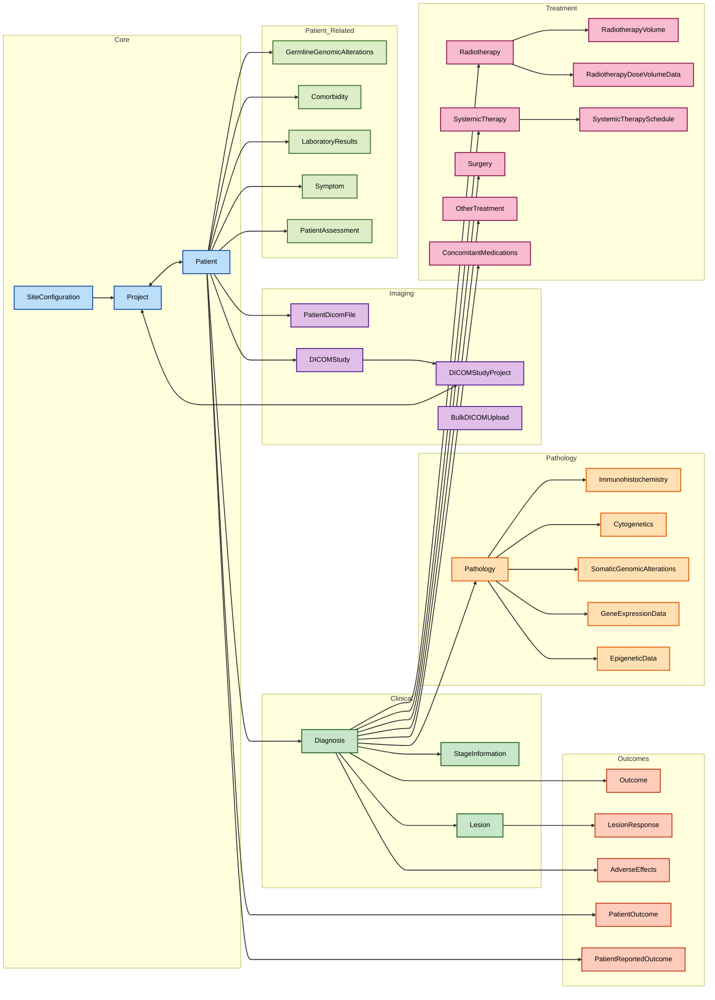

## Welcome

The CHAVI Client Application is a companion application to the CHAVI de-identification system. This application allows users to enter patient data at their own premises and this clinical data can then be de-identified in a reproducible fashion. While the application is primarily designed for data entry using the provided forms, it is possible to allow import of data from other sources like CSV and other databases in the future.

## Features and Functionality

### Patient Management
- Register and track patients with unique identifiers
- Record demographic information
- Manage patient consent for CHAVI system
- Track patient registration dates and project associations
- Import/export patient data in bulk

### Clinical Data Management

#### Diagnosis Tracking
- Record multiple diagnoses per patient
- Track cancer system and specific diagnosis (ICD codes)
- Record diagnostic modalities and presentation types
- Link diagnoses with anatomical sites and laterality
- Associate DICOM studies with diagnoses

#### Pathology Data
- Comprehensive pathology reporting including:
  - Tumor characteristics (size, location, grade)
  - Histological details
  - Margin status
  - Lymph node information
- Track immunohistochemistry results
- Record cytogenetics findings
- Document somatic genomic alterations

#### Treatment Management

1. **Radiotherapy**
   - Record treatment schedules and doses
   - Track radiation modalities and techniques
   - Document treatment volumes and anatomical locations
   - Store dose-volume data
   - Link to DICOM studies

2. **Surgery**
   - Document surgical procedures
   - Track nodal assessments
   - Record reconstruction details
   - Link surgical records with DICOM studies

3. **Systemic Therapy**
   - Manage chemotherapy and other systemic treatments
   - Track treatment cycles and schedules
   - Record drug dosing information
   - Monitor treatment responses
   - Link with DICOM studies

4. **Concomitant Medications**
   - Track additional medications
   - Record dosing and administration details
   - Monitor medication periods

### Clinical Monitoring

#### Laboratory Results
- Record and track laboratory test results
- Store test values and units
- Track result dates
- Support multiple test types

#### Adverse Effects
- Document treatment-related adverse effects
- Use standardized CTCAE grading
- Track onset and resolution dates

#### Disease Monitoring
- Track lesions and their measurements
- Record treatment responses
- Monitor disease progression
- Link with imaging studies

### Outcomes Tracking
- Record patient survival status
- Track disease-specific outcomes
- Document cause of death when applicable
- Monitor disease progression
- Record patient-reported outcomes (PRO)
  - Support multiple PRO instruments
  - Track domains and questions
  - Record patient responses and scores

### DICOM Integration
- Upload and process DICOM files
- Automatic extraction of study metadata
- Link imaging studies with clinical data
- Organize studies by patient
- Support for multiple imaging modalities

### Data Export and Integration
- Export complete patient datasets
- Generate JSON-formatted data exports
- Create zipped archives of patient data
- Support for bulk data operations
- Maintain data relationships in exports

### Administrative Features
- Secure user authentication
- Role-based access control
- Site configuration management
- Project management
- Audit trail for data modifications

### Data Import/Export
- Support for bulk data operations
- Import data from CSV files
- Export data in JSON format
- Maintain data relationships in exports
- Generate comprehensive patient data packages

## Database Schema

The database schema in the client application mimics the central CHAVI server database with few exceptions related to the user authentication tables. This allows data to be faithfully migrated to the central CHAVI server while retaining the longitudinal temporal linkage. 

## How to Install

First of all ensure that you have the latest version of Python 3 installed in your computer. Please see the official documentation available at https://www.python.org/downloads/ for system specific instructions. If you are using a Linux based system then this may be available in your repository.

Please clone the git repository in your computer using the following command. If you have SSH keys installed then you can use the alternative SSH command.

```
git clone https://gitlab.com/drsantam/chavi_client.git
```

After that create a python virtual environment using a package of your choice. We have used venv in this project and you can use the same also by following the instructions available at the Virtualenv website - https://virtualenv.pypa.io/en/legacy/installation.html

After the virtual environment has been created you will be able to activate the virtual environment. From inside the virtual environment install the project requirements. 

```
pip install requirements.txt
```

This will pull and install all the required packages. Note you may need to have an IT administrator to help you with the package installs. Additionally you may find that in Windows system Folder Access Policies prevent the script from running. In these cases please contact your IT Administrator for appropriate privileges. 

After the installation is completed then you should perform the following steps:  

### Database Setup
Create the database. Note the application is developed using a SQLite database but can accept other database engines too. Note that we will be pulling in all the lookup table data also in the same command. 

```
python manage.py migrate
```

## Environment Setup

Create a .env file in the root directory and add the following variables.

``` 
DJANGO_SECRET_KEY=django-insecure-%zvbz3$uzi$kvpd$2@5+6-=@7&8%l4^-lp!$(s#ysd9w8)fe! # Add secret key of the project. Ensure this is changed before deployment.
DEBUG=True # Set to True for development, False for production
DJANGO_ALLOWED_HOSTS='127.0.0.1,localhost' # Add other hosts if needed seperated by commas

DJANGO_DB_ENGINE=django.db.backends.postgresql # Add engine of the database
DJANGO_DB_NAME=chaviclient # Add name of the database
DJANGO_DB_USER=postgres # Add username of the database  
DJANGO_DB_PASSWORD=26rishi1978 # Add password of the database
DJANGO_DB_HOST=localhost # Add host of the database
DJANGO_DB_PORT=5432 # Add port of the database
```
See the sampleenv file for reference.

### Create a Superuser
Create a superuser. This superuser can be a local administrator.

```
python manage.py  createsuperuser
```
This will take you through a wizard where you will be asked to setup an username, provide your email address and set a password. Please ensure that this password is a long and complex password for security.

### Start the server

Start the server to start the application. The server will allow users from the LAN to access the client application. By default the application will be available on port 8000.

```
python manage.py runserver
```

After the server starts at the designated port on the localhost please access the server using the appropriate localhost port. Enter your superuser username and password to access the admin site. The path to the admin site is http://localhost:8000/admin

## Post Installation

### Create Site
The first step after logging in is to create a new site configuration. To do so go the form titled "Site Configuration" and click on the "Add Site Configuration" button. This will allow you to enter the site details. Please remember to put the site ID as the one which has been provided to you by the CHAVI team.

### Create User Group
The next step is to create a user group. To do so go the form titled "User Group" and click on the "Add User Group" button. This will allow you to enter the user group details. Please remember to put the user group ID as the one which has been provided to you by the CHAVI team. Also ensure that they are marked as staff so that they can access the admin interface.

### Create User
The next step is to create a user. To do so go the form titled "User" and click on the "Add User" button. This will allow you to enter the user details. Please remember to put the user ID as the one which has been provided to you by the CHAVI team.

## Usage Guidelines

### Accessing the Application
1. Navigate to `http://localhost:8000` (or your configured host)
2. Log in with your credentials
3. Access the appropriate forms based on your role

### Data Entry Workflow
1. Register/select a patient
2. Enter clinical information using the appropriate forms
3. Save and validate the data
4. Export or synchronize with the central server when ready

### Best Practices
- Always verify patient information before entry
- Use standardized terminology from lookup tables
- Regularly backup your database
- Keep the application and its dependencies updated
- Follow your organization's data privacy policies

## Support and Troubleshooting

For technical support or questions about the application:
- Check the application logs for errors
- Contact your system administrator
- Reach out to the CHAVI team for advanced support

## Contributing

If you'd like to contribute to the development of CHAVI Client Application:
1. Fork the repository
2. Create a feature branch
3. Submit a pull request with your changes

## Model Relationships



Legend:
- `-->` indicates a One-to-Many relationship
- `<-->` indicates a Many-to-Many relationship
- Colors represent different functional groups:
  - Light Blue: Core system models
  - Purple: Imaging-related models
  - Green: Clinical data models
  - Orange: Pathology-related models
  - Pink: Treatment-related models
  - Light Green: Patient-related data
  - Deep Orange: Outcomes and monitoring data

Note: This diagram shows the primary relationships between models. Lookup tables that provide standardized options for various fields are excluded for clarity.


## Extractor (LLM extraction) — Operations

The `extractor` app converts uploaded clinical documents (PDF/CSV/XLSX) to text
and extracts structured records via an OpenAI-compatible LLM using Instructor.

### Environment

| Variable | Default | Purpose |
|---|---|---|
| `EXTRACTOR_MAX_UPLOAD_MB` | 50 | Uploads larger than this are rejected before storage |
| `DJANGO_FIELD_ENCRYPTION_KEY` | required | Fernet key encrypting API keys and extracted data |

LLM/embedding endpoint policy is fixed in code: `https://` is allowed
anywhere; `http://` is allowed only for localhost/LAN endpoints.

The embedding index is fixed at **1536 dimensions** (`LookupEmbedding` uses a
pgvector HNSW index). OpenAI v3 embedding models emit 1536 via the
`dimensions` API parameter; local providers must output 1536 natively.

### OCR (scanned PDFs)

Files whose PDF conversion yields little/no text are flagged `no_text`/`low_text`
and get a **Run OCR** button on the file detail and patient pages. OCR requires
system packages (already in the Dockerfile):

```
apt install tesseract-ocr poppler-utils
```

OCR runs under Celery and produces a new versioned `ProcessedText` row
(`ocr_applied=True`) that can be extracted like any other version.
| `LOOKUP_API_URL` / `LOOKUP_API_KEY` | — | Lookup service for label↔code resolution |

### Background workers

Extraction jobs and embedding index builds run under **Celery** (RabbitMQ
broker already configured). A worker must be running:

```
celery -A chavi_client worker -l info
```

### Lookup embeddings

Build or refresh the semantic-search index:

```
python manage.py compute_lookup_embeddings          # fill gaps in current index
python manage.py compute_lookup_embeddings --refresh # build new index version, swap on success
```

A failed `--refresh` never destroys the working index. Embeddings from
changed/deleted lookup rows are flagged stale automatically.

### Data lifecycle

Extraction jobs and results are **staging data** — deleting an uploaded file
cascade-deletes its processed text, jobs, and results. The delete confirmation
shows the dependent counts.

## DICOM Server (`dicom_server`)

An inbound DICOM service that receives DICOM data **into** the application —
it never sends instances outward. All received data is written to the existing
`client_app` models (`Patient` → `DICOMStudy`) and stored under
`media/processed_dicom/<patient>/<study>/<sop>.dcm`.

**Patient allow-list:** only instances whose `PatientID` matches an existing
`Patient` row (exact match, then the same canonical-ID matching used by the
bulk importer) are accepted. Everything else is rejected — no patient records
are ever created automatically.

### Services

- **C-ECHO SCP** — verification.
- **C-STORE SCP** — inbound storage (all storage SOP classes).
- **C-FIND SCP** — patient/study-level query against the local database.
- **Query/Retrieve SCU** — pull studies inward from configured remote PACS
  via C-GET or C-MOVE.

### Running the SCP

Development (separate process — **not** a management command):

```bash
python -m dicom_server
```

Production: the `chaviclient-dicom` docker-compose service starts it
automatically (`command: ["python", "-m", "dicom_server"]`, publishes port
`11112`). Configuration is **database-backed** — the published port must
match the configured listen port. The process waits for the database at
startup and shuts down cleanly on SIGTERM/SIGINT.

### Configuration (staff only)

All DICOM configuration lives in the database — **no environment variables**.
Staff users (`is_staff`) can edit:

- **DICOM Server → Server configuration** (`/dicom-server/config/`): AE title,
  bind address, port, max PDU, Q/R timeout, storage enable/disable. Changes to
  AE title/bind/port take effect on the next server restart.
- **DICOM Server → Remote nodes** (`/dicom-server/nodes/`): remote PACS
  name/AE title/host/port, active flag, and **prefer C-GET**. Includes a
  C-ECHO connectivity test button.

### Query/Retrieve (frontend)

Users with the `client_app.add_dicomstudy` permission can access
`/dicom-server/` — dashboard, retrieval form (`/dicom-server/retrieve/`), and
job history. Retrieval runs under Celery (`dicom_server.task_retrieve_studies`)
and reports progress through the existing `TaskRun`/`Notification`
infrastructure. Every received instance is audited in `InboundDICOMInstance`
(visible in Django admin).

**C-GET vs C-MOVE:** C-GET receives instances over the same association — use
it when this server cannot accept inbound connections from the remote (e.g.
behind NAT; this is the case for `dicomserver.co.uk`). C-MOVE requires the
remote to open a connection back to this server's configured AE title/port, so
this host must be reachable from the remote.

### Testing

```bash
python manage.py test dicom_server          # unit + loopback + stub-PACS tests
DICOM_LIVE_TESTS=1 python manage.py test dicom_server.tests.test_live  # live
```

The live suite targets `www.dicomserver.co.uk:11112` by default (override with
`DICOM_LIVE_HOST`/`DICOM_LIVE_PORT`/`DICOM_LIVE_AET`). It pushes only
synthetic, anonymised datasets — never send real patient data to a public
server. Live tests use C-GET because public-server C-MOVE requires a publicly
reachable destination AE.
